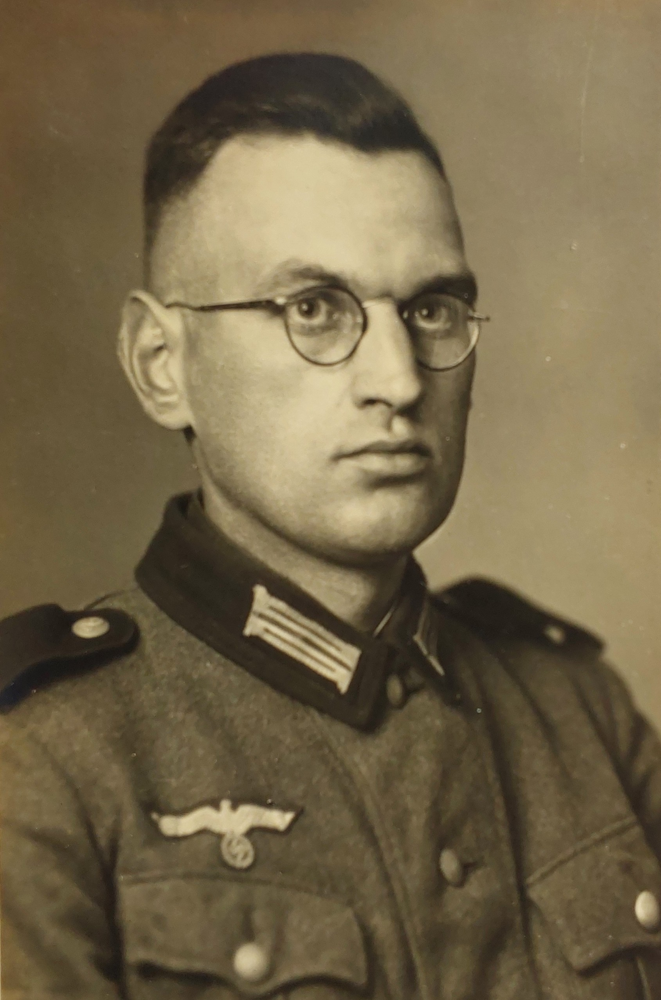
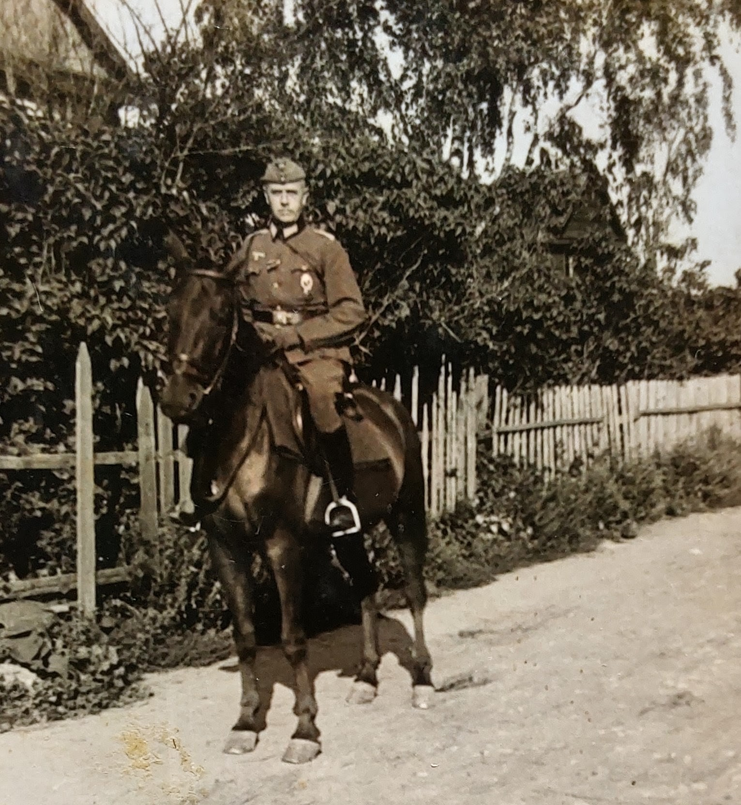
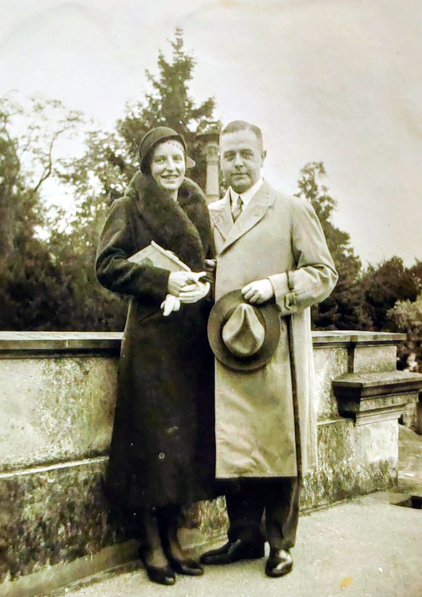

# Erich Görcke

Erich Görcke war der Schwager von [Hans Detlef Hölk](../hoelk-hans-detlef/) und mit Marga, geborene Hölk, verheiratet. Das Paar hatte drei Kinder: Elke, Hans-Richard und Erich. 

Im Zivilberuf arbeitete Erich Görcke als Amtsrichter am Amtsgericht Gettorf. Die Familie lebte vor und während des Zweiten Weltkriegs in Gettorf. Sein Name ist auf einer Namenstafel des Gettorfer Ehrenhains für die Opfer des Zweiten Weltkriegs verewigt.

Im Krieg diente er im Dienstgrad eines Oberleutnants. Entgegen früherer familiärer Überlieferungen, die "Russland" als Sterbeort nannten, belegen Aufzeichnungen des Volksbundes Deutsche Kriegsgräberfürsorge, dass Erich Görcke am 07.04.1945 verstarb und in Dänemark beigesetzt wurde. Wahrscheinlich wurde er von der Ostfront über die Ostsee evakuiert und verstarb auf dem Transport oder im Lazarett in Kopenhagen. Er ruht heute auf der Kriegsgräberstätte Kopenhagen West (Vestre Kirkegård) in Block E, Reihe 12, Grab 1654.

## Fotografien

  
  
  

## Grablage

[📍 Vestre Kirkegård Kopenhagen auf Google Maps öffnen](https://www.google.com/maps/search/?api=1&query=Vestre+Kirkegård+Kopenhagen)

<iframe 
  width="100%" 
  height="300" 
  style="border:0; border-radius: 8px; margin-top: 10px;" 
  loading="lazy" 
  allowfullscreen 
  src="https://maps.google.com/maps?q=Vestre+Kirkegård+Kopenhagen&t=&z=12&ie=UTF8&iwloc=&output=embed">
</iframe>
