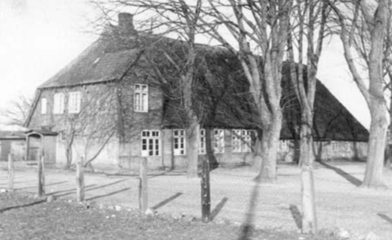

# Max Gosch 

Max Gosch wurde am 11. April 1900 in Kiel-Pries geboren. Er lebte in Neuwittenbek, wo er als Lehrer an der Dorfschule unterrichtete. Im Zweiten Weltkrieg diente er als Gefreiter.

Mit seiner Ehefrau Marie (geb. Hammerich) hatte er eine Tochter, Karin. Die Familie lebte auf dem Hof Brammer.

<figure style="margin: 20px 0;">
  
  <figcaption style="font-style: italic; margin-top: 8px; font-size: 0.9em; color: #555;">
    Die alte Schule von Neuwittenbek. Hier hat Max Gosch unterrichtet. Sie liegt direkt am Dorfplatz neben den Gedenksteinen, den sprechenden Steinen.
  </figcaption>
</figure>

Am 19.(9.?) Februar 1945 starb Max Gosch im Reservelazarett in Halberstadt.

[📍 Halberstadt auf Google Maps öffnen](https://www.google.com/maps/search/?api=1&query=Halberstadt%2C%20Deutschland)

<iframe 
  width="100%" 
  height="300" 
  style="border:0; border-radius: 8px; margin-top: 10px;" 
  loading="lazy" 
  allowfullscreen 
  src="https://maps.google.com/maps?q=Halberstadt%2C%20Deutschland&t=&z=5&ie=UTF8&iwloc=&output=embed">
</iframe>
