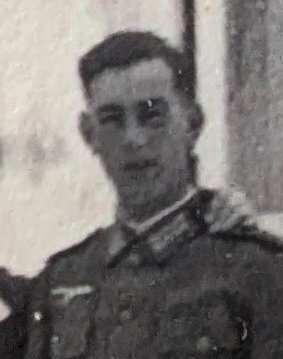
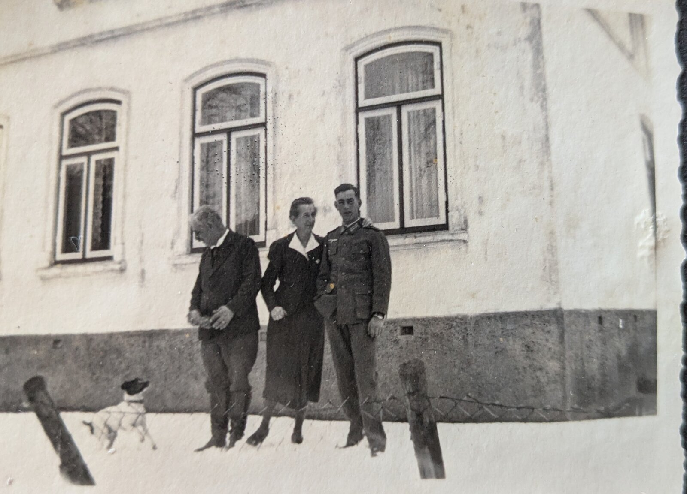
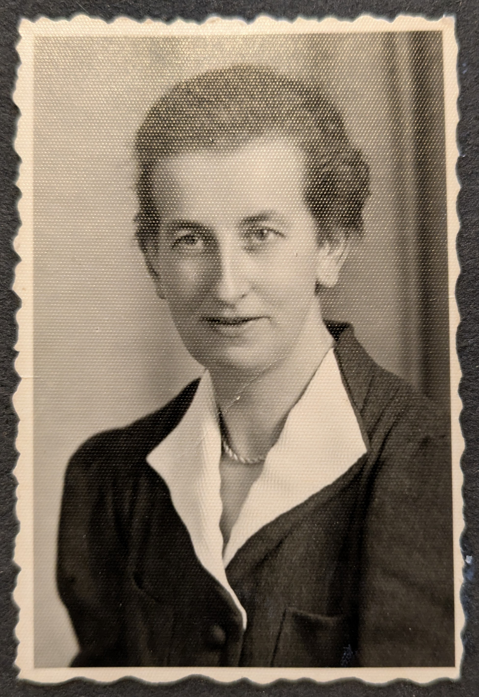

# Hans Paetow

Hans Paetows Vater war Verwalter auf Warleberg und er dessen einziger Sohn.

Hans Paetow wird seit 1944 in Russland vermisst.

Das Foto zeigt ihn mit seinen Eltern vor deren Haus in Gettorf (gegenüber Kunze).

Hans Paetows Mutter
