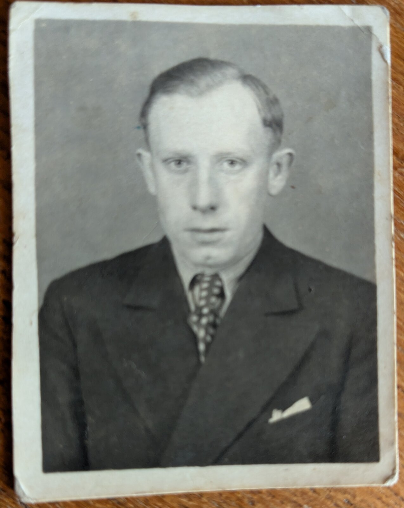
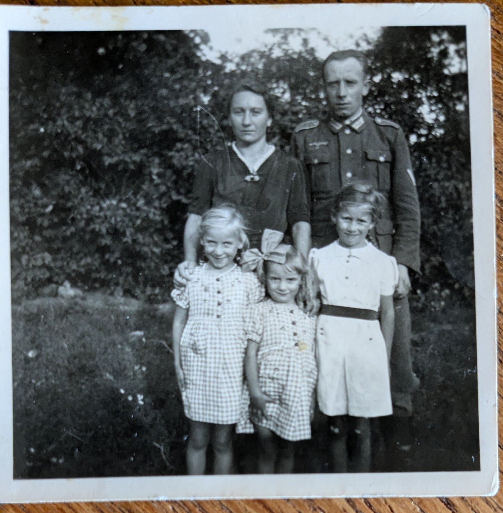
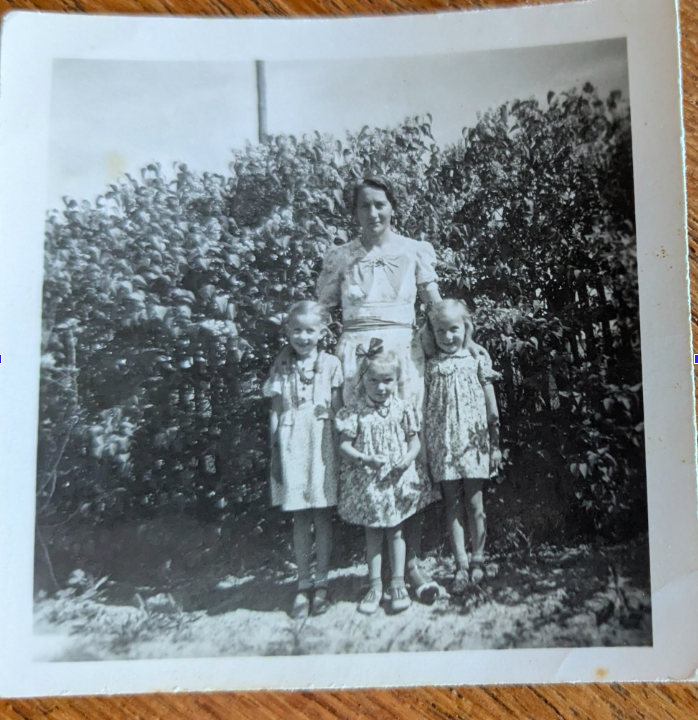

# Walter Schneider

Walter Schneider lebte mit seiner Frau und den drei Töchtern (die jüngste ist Lisbeth Stein) in Ostpreußen, den nördlichen Masuren. Beruflich war er Tiefbauarbeiter. Seine Familie flüchtete an die Ostseeküste, verpasste dort die "Gustloff" und kam auf dem [Hof Neuwittenbek (Familie Hölk)](../hoelk-hans-detlef/) unter.

Walter Schneider hat Neuwittenbek nie kennengelernt er ist am 22.11.1944 in Russland gefallen.

[📍 Russland auf Google Maps öffnen](https://www.google.com/maps/search/?api=1&query=Russland)

<iframe 
  width="100%" 
  height="300" 
  style="border:0; border-radius: 8px; margin-top: 10px;" 
  loading="lazy" 
  allowfullscreen 
  src="https://maps.google.com/maps?q=Russland&t=&z=2&ie=UTF8&iwloc=&output=embed">
</iframe>
