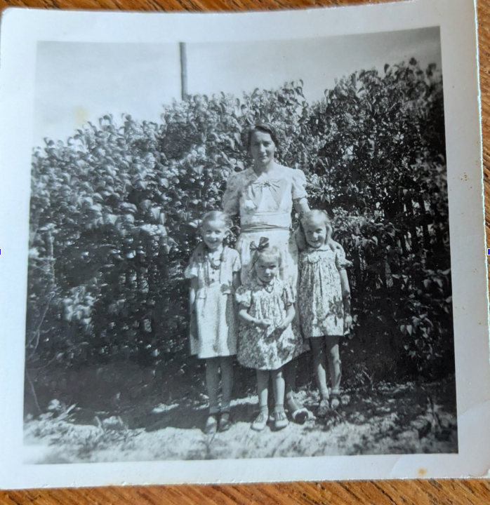

# Walter Schneider

Walter Schneider lebte mit seiner Frau und den drei Töchtern (die jüngste ist Lisbeth Stein) in Ostpreußen, den nördlichen Masuren. Beruflich war er Tiefbauarbeiter. Er kam am 22.11.1944 um, seine Familie flüchtete an die Ostseeküste, verpasste dort die "Gustloff".  Sie kamen auf dem Hof Neuwittenbek unter.

