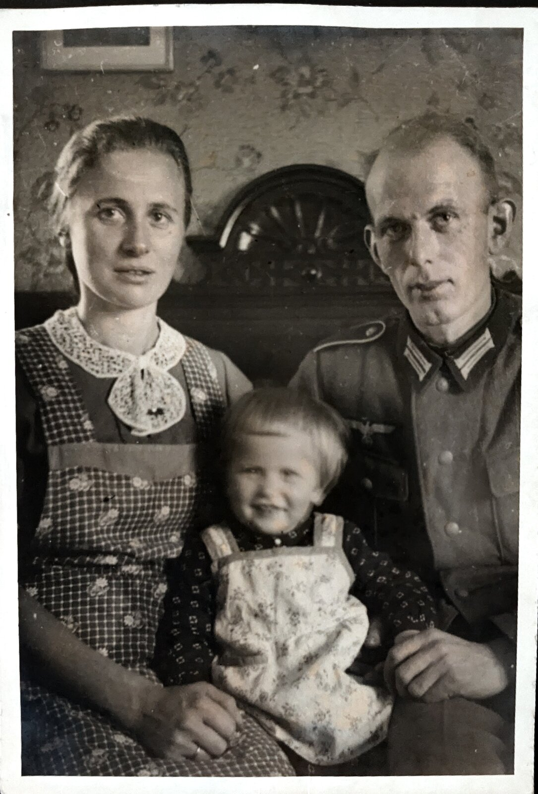
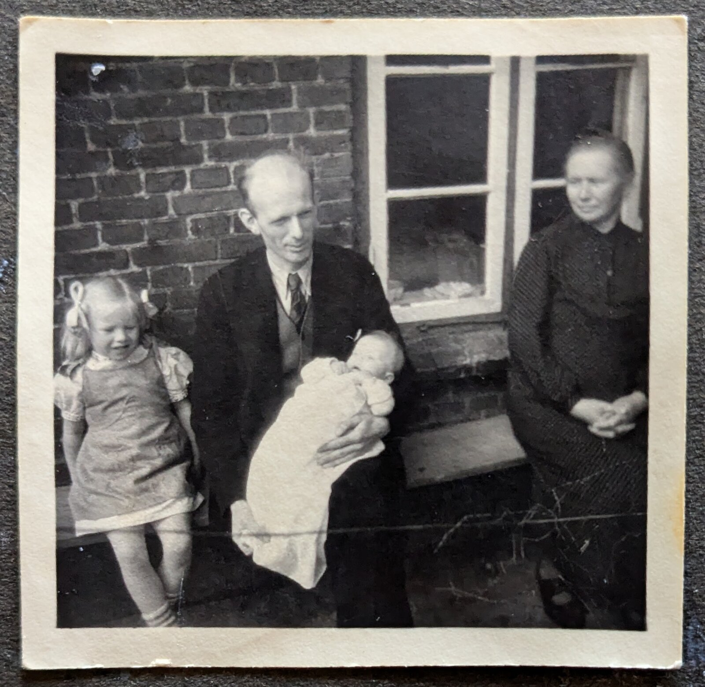

# Heinrich Ströh

Heinrich Ströh war Sattlermeister.

Heinrich Ströh wurde mit Tuberkulose entlassen und starb am 16.11.1951 an den Kriegsfolgen. 

Am Tag der Taufe von Frau Tams wurde dieses Bild gemacht. Heinrich Ströh hält Karin Tams auf dem Arm. Links daneben steht ihre Schwester. Oma, ganz rechts, wollte eigendlich nicht mit aufs Bild.

